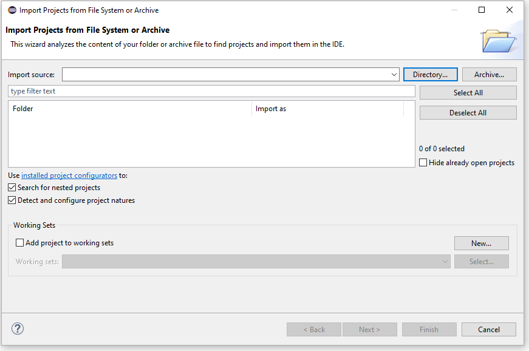
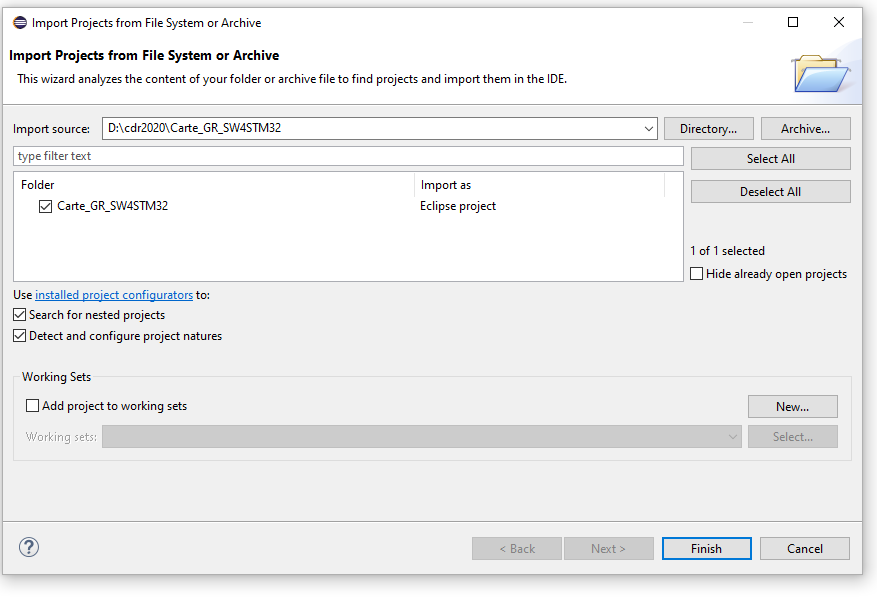
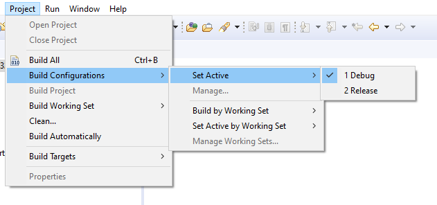

# Installation System Workbench pour STM32
Allez sur le site [System Workbench pour STM32](https://www.openstm32.org/System+Workbench+for+STM32).
Créez un compte et télécharger le programme d'installation pour votre OS.
Installez System Workbench pour STM32.

# Import du projet
Ouvrez System Worbench pour STM32.
Cliquez sur Open Project from File System dans le menu File.
Cliquez sur le bouton Directory et sélectionnez le chemin du repository Carte_GR_SW4STM32.

Cliquez sur Finish.

# Build
Sélectionnez la configuration de build.
Cliquez sur Build.

# Configuration Debug
Cliquez sur Debug Configurations dans le menu Run.
Faites un click droit sur GDB Hardware Debugging et sélectionnez l'option New.
Dans l'onglet Main, cliquez sur Browse et et sélectionnez le projet.

Dans l'onglet Debugger, cliquez sur Browse et sélectionnez le chemin du programme arm-none-eabi-gdb.exe.
Entrez l’adresse et le port utilisés par le débuggeur openocd. Vous pouvez utiliser localhost et vous connecter à la raspberry pi du robot en utilisant ssh avec l'option de forward de port.

# Debug
Lancez openocd avec la commande ``openocd -f /usr/share/openocd/scripts/board/st_nucleo_f3.cfg`` sur la machine à laquelle est connectée la carte nucleo.
Cliquez sur Debug Configurations dans le menu Run, sélectionnez votre configuration de debug et cliquez sur le bouton Debug en bas à droite de la fenêtre, ou bien cliques sur votre configuration dans le sous menu Debug History du menu Run.

